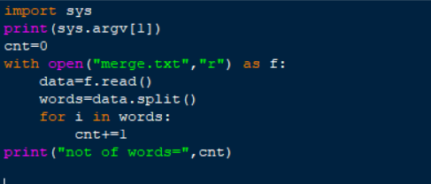
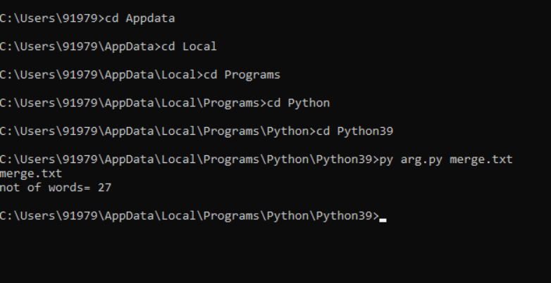

# command-line-arguments-to-count-word
## AIM:
To write a python program for getting the word count from the contents of a file using command line arguments.
## EQUIPEMENT'S REQUIRED: 
PC
Anaconda - Python 3.7
## ALGORITHM: 
### Step 1:
import sys

### Step 2:
open existing file

### Step 3:
read the content and store it in a variable

### Step 4:
split the words in the variable and count the occurrence

Step 5:
print the no of words 

## PROGRAM:
import sys
print(sys.argv[1])
cnt=0
with open("merge.txt","r") as f:
    data=f.read()
    words=data.split()
    for i in words:
        cnt+=1
print("not of words=",cnt)

### OUTPUT:

## RESULT:
Thus the program is written to find the word count from the contents of a file using command line arguments.
